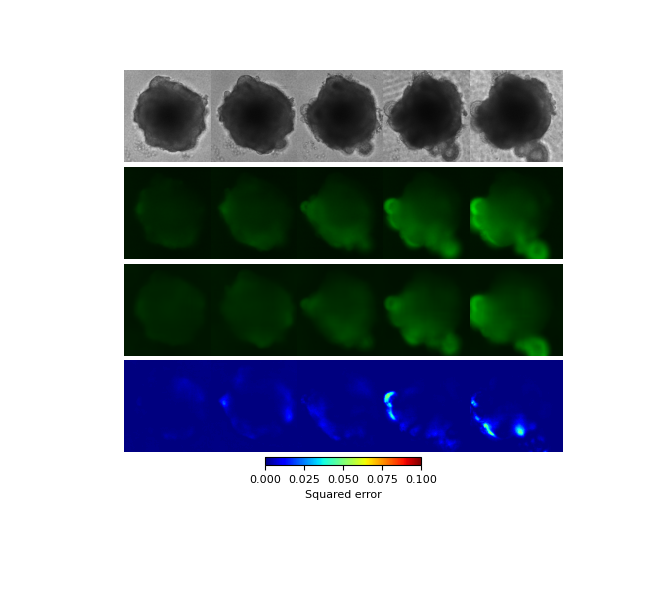

# Machine learning-based estimation of spatial gene expression pattern during ESC-derived retinal organoid development

This is the code of "Machine learning-based estimation of spatial gene expression pattern during ESC-derived retinal organoid development."
<br>
The paper on bioRxiv (https://www.biorxiv.org/content/10.1101/2023.03.26.534261v1)

## Requirements
Our experimental environment is
```
Ubuntu 20.04
CUDA 11.3.1
pytorch 1.11.0
```
The requirements can be installed by
```
conda install --name organoid --file requirements.yml
conda activate organoid
```

## Pre-trained models
We provide our pre-trained model, which can be downloaded as
```
wget 'https://onedrive.live.com/download?cid=22AA8A9F0CDA7E59&resid=22AA8A9F0CDA7E59%2124986&authkey=ALoL8L1euqJQNJs' -O ckpts.tar.gz
tar -zxvf ckpts.tar.gz
```

## Sample result
We provide a sample code for the results in Fig. 2 in the paper.
```
python sample.py ckpts resnet
python fig2.py
```


